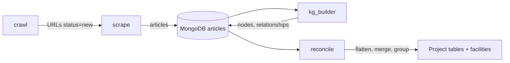
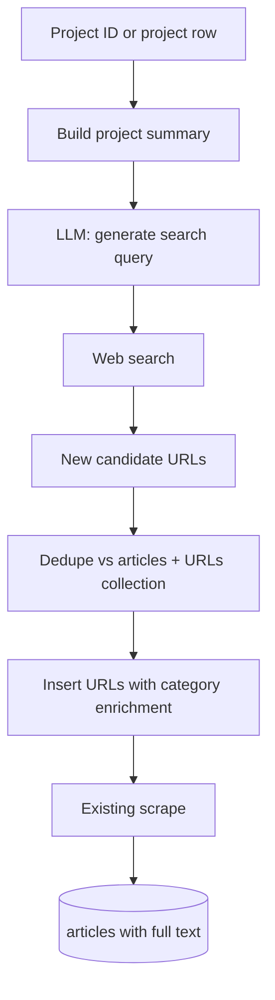

# Project enrichment: AI/LLM search for new articles (through to DB with full text)

## Current pipeline (context)

- **Projects** are defined in [reconcile/group.py](reconcile/group.py): `project_id = uuid5(iso2, admin_group_key, inst_canon, product_lv1)`. Grouped outputs and [reconcile/facilities.py](reconcile/facilities.py) write facility records (project_id, inst_canon, iso2, admin_group_key, product_lv1, etc.) to MongoDB.
- **New content** enters via the URLs collection: documents with `{ url, category, status: "new" }`. [scrape/scrape-articles.py](scrape/scrape-articles.py) consumes `status: "new"`, scrapes, inserts into articles_collection with `meta.category`, and sets URL status to `extracted`/`irrelevant`/`failed`.
- **Existing LLM + web search**: [web-browsing.py](web-browsing.py) uses the OpenAI Responses API with `web_search_preview` to answer a user prompt and return evidence with URLs; it does not currently feed those URLs into the DB or pipeline.

## Proposed architecture

Plan scope ends here. The user runs kg_builder (with category "enrichment") and reconcile separately to flow new articles into the KG and project tables.

## Implementation plan

### 1. Project summary and input

- **Source of project(s)**:
- Read from MongoDB facilities collection (already has project_id, inst_canon, iso2, admin_group_key, product_lv1, product_lv2). 
- **Articles attached to the project**: For each project, resolve **all** article IDs that belong to it (from a query that joins facilities/flatten output to articles). Relevant articles are listed inside the events array (articleID). Only consider events when event_type == capacity or investment. Only take the most recent 15 filtered events in case necessary. 
- Fetch from articles_collection using articleID:`title, date`and all paragraphs. 
- **Consistent summary**: Build one coherent project summary by combining (1) **phase summary** output (from [reconcile/phase_summary.py](reconcile/phase_summary.py)): capacity and investment per phase, status, dates, and any `investment_was_imputed` flag; (2) **structured project fields** (inst_canon, admin_group_key, product_lv1, iso2); and (3) **attached article titles/paragraphs**. Options: (a) **Concatenate** these into a fixed-format string for the next step; or (b) **LLM summarisation**: one short prompt that takes the phase timeline, project identity, and "Existing articles: [title 1], [title 2], …" and returns a single, consistent 2–4 sentence summary (no redundancy, key facts merged; optionally a short "uncertainties" list). That summary is then used for search-query generation. Note: source data (phases, events, articles) may contain errors or conflicts; the summary step should merge/deduplicate where possible, and enrichment search can later surface corrective coverage.

**Deliverable**: New module (e.g. `enrichment/` at repo root, or `reconcile/enrichment/`) with:

- `get_projects_for_enrichment(project_ids: list[str] | None, limit: int | None) -> list[dict]` reading from facilities collection (and optionally from Excel).
- `get_articles_for_project(project_id: str) -> list[dict]`: returns all articles linked to that project (from grouped tables or a join); each dict at least `article_id`, `title`, optionally `snippet` (e.g. first paragraph).
- `build_project_summary(project: dict, articles: list[dict], phases: list[dict] | None = None, use_llm: bool = True) -> str`: builds one consistent summary from project fields, optional **phase summary** data (capacity/investment per phase, status, dates), and all attached article titles/snippets; if `use_llm`, call a small LLM step to merge and deduplicate into 2–4 sentences (and optionally an uncertainties list).

### 2. Search: query generation and URL discovery

- **Query generation**: Use the existing OpenAI client to call a chat/completion model with a small system prompt: "Given this clean-tech project summary, output 1–3 concise search queries (one per line) that would find recent news articles about this project (investments, capacity, construction, subsidies)." Input = project summary; output = plain text lines of queries.
- **URL discovery** (choose one or combine):
  - **Option A (recommended for minimal new deps)**: Use OpenAI Responses API with `web_search_preview` (as in [web-browsing.py](web-browsing.py)). Prompt: "Find recent news articles about: [project summary]. Return a list of full article URLs with publication date and title." Parse the model output (or a structured tool response if available) to extract URLs. Limitation: output format may be unstructured; may need a second LLM call to parse "list of URLs" from the response. We can encourage the model to return structured format, also **explicitly setting a JSON schema if necessary.**
- **Deduplication**: Before inserting URLs:
  - Get existing URLs: (1) `articles_collection.distinct("meta.url")`, (2) `urls_collection.distinct("url")`.
  - Filter candidate URLs to those not in either set (normalise URL for comparison: strip fragment, lowercase host, also normalise any chatGPT suggested URLs that end in ?utm_source=[chatgpt.com](http://chatgpt.com) - just drop that from the end if present, etc.).
- **Insert**: Insert into URLs collection: `{ url, category: "enrichment", status: "new" }`. Optionally add `enrichment_for_project_id: project_id` (or a list of project_ids if one search served multiple projects) so you can later report which articles were discovered for which project. Ensure [scrape/scrape-articles.py](scrape/scrape-articles.py) can handle `category == "enrichment"` with the enrichment extractor and publication-date rule (see section 3): only set date when confident; otherwise `None`.

**Deliverable**:

- `enrichment/search.py` (or similar): `generate_queries(project_summary: str) -> list[str]`, `discover_urls(queries: list[str], method: "openai_web_search" | "serp") -> list[dict]` (each dict: url, title?, date?), `dedupe_and_insert_urls(candidates: list[dict], project_id: str | None) -> int` (returns count inserted).

### 3. URL text extraction: options for getting article text from new URLs

Enrichment URLs can point to **any** domain (news sites, press releases, blogs), not just the known crawl sources. The current scraper uses **per-category** logic: [scrape/scrap_function/utility.py](scrape/scrap_function/utility.py) has `DATE_SELECTORS` and special branches (e.g. `transformers-magazine`, `energytech`). For an unknown category like `"enrichment"`, it would fall back to: **all `
` tags on the page** and **date = "No Date Found"** (current code then uses today in `get_utc_date_from_raw`—we do **not** want that for enrichment; see publication-date rule below). That often pulls in nav, ads, and footer, and fails on JS-rendered or paywalled pages. Below are options, from simplest to most capable.

| Option                                      | Approach                                                                                                                                                                                                                                       | Pros                                                                                            | Cons                                                                                               |
| ------------------------------------------- | ---------------------------------------------------------------------------------------------------------------------------------------------------------------------------------------------------------------------------------------------- | ----------------------------------------------------------------------------------------------- | -------------------------------------------------------------------------------------------------- |
| **A. Default scrape path**                  | Use existing scrape with `category: "enrichment"`. No new code; `get_date(soup, "enrichment")` returns "No Date Found" (stored as fetch date). Body = all `
` from raw HTML.                                                                 | Zero new dependencies; works for simple static articles.                                        | No main-content detection; noisy text; no JS; date often wrong.                                    |
| **B. Generic HTML extractor (readability)** | Add a library that finds the “main” content block (article/main or heuristics), strip nav/ads, extract paragraphs. Examples: `readability-lxml`, `newspaper3k`, `goose3`, or `trafilatura`. Use for `category == "enrichment"` only.           | One extra dependency; much better main-content extraction on many sites; no per-site selectors. | Still no JS; date still heuristic (meta tags or regex); quality varies by site.                    |
| **C. Browser-based extraction**             | Use Selenium or Playwright: load URL in headless browser (executes JS), then extract text (e.g. `document.body.innerText` or run readability in browser). Use when requests-based fetch returns too little text or for known JS-heavy domains. | Handles JS-rendered pages.                                                                      | Slower, heavier; some sites block headless; still need heuristics or readability for main content. |
| **D. Extraction API / service**             | Call an external “URL → article text” API: e.g. **Mercury Parser** (Postlight, self-hosted or API), **Diffbot**, **Firecrawl**, **Jina Reader** (`r.jina.ai/{url}`), or similar. Send URL; get back title, date, clean text.                   | High quality on many sites; maintained by provider; often handle JS.                            | Cost, rate limits, external dependency; URLs leave your infrastructure (privacy).                  |
| **E. Hybrid pipeline**                      | Try **B** (or **A**) first. If result is “too short” or “no main content” (e.g. < 200 chars or no `<article>`), optionally retry with **C** or **D**. Store `meta.extraction_method: "readability"                                             | "browser"                                                                                       | "api"` for debugging.                                                                              |
| **F. Snippet-only (no full scrape)**        | If search API returns snippets (e.g. SerpAPI/Bing), store **snippet + URL + title** as a minimal “article” (no full body).                                                                                                                     | Fast; works when page is unscrapable or paywalled.                                              | Weak for KG (little text); use only as last resort or for lightweight evidence.                    |

**Decision**: Use **B (generic HTML extractor / readability-style)** for `category == "enrichment"`. No JavaScript, Selenium, or browser-based extraction for now. Add a single dependency (e.g. `trafilatura` or `readability-lxml`), implement an `extract_article_enrichment(url)` that returns `{ title, date, paragraphs }` or `None` when no main content is found. Call it from [scrape/scrape-articles.py](scrape/scrape-articles.py) when `category == "enrichment"` instead of the default soup path. Use the publication-date rule below (no generic date fallback; see below). `<meta property="article:published_time">`, or `datetime` in HTML, or “No Date Found”) in **When no main content is returned** (extractor returns `None` or empty/too-short body): do **not** update the URL document status—leave it as `"new"` (or unchanged) so the URL remains in the queue; do not insert an article. Over time we collect more URLs and can later decide whether to introduce browser-based or API-based extraction for those that never yield content. No hybrid pipeline (E) or JS (C) for now.

**Publication date (enrichment)**  
Accurate publication date is crucial for ordering, recency, and tying facts to the right phase. **Always fall back to `None` (or equivalent) when the publication date cannot be determined with confidence; do not use fetch date or "today".** For enrichment only, try date sources in this order: (1) High-confidence machine-readable: `<meta property="article:published_time">` (ISO 8601), `<time datetime="...">`, or JSON-LD `datePublished`; parse and validate; if parsing fails, treat as no date. (2) Other meta or in-page dates only if clearly article publication (e.g. `article:modified_time` is secondary; prefer published). (3) If none of the above yield a confident value, store `None`. The enrichment extractor and scrape path for `category == "enrichment"` must never default to fetch date—unlike the current `get_utc_date_from_raw` behaviour for other categories.

### 4. Wiring into scrape (plan ends at articles in DB)

- **Scrape**: For `category == "enrichment"`, use the **dedicated extractor (Option B)** and the publication-date logic above (high-confidence sources only; fallback to `None`, never fetch date). If the extractor returns no main content (or too little), do **not** insert an article and do **not** update the URL status—leave the URL as-is so it can be retried or revisited later. If extraction succeeds, set article `meta.date` only when a confident publication date is available; otherwise set to `None`. Optionally copy `enrichment_for_project_id` from URL doc to article `meta`. The outcome of this plan is enrichment articles in the articles collection with full text and `meta.category == "enrichment"`.

**Deliverable**:

- Script or CLI: `enrichment/run_enrichment.py` (or `python -m enrichment`) that: (1) takes `--project-id` or `--project-ids` or `--limit`, (2) gets project summaries, (3) generates queries, (4) discovers URLs, (5) dedupes and inserts URLs, (6) runs scrape (subprocess or in-process) so new enrichment articles are in MongoDB with full text. Steps 5–6 can be configurable (e.g. insert URLs only, or run scrape only) so the user can run scrape separately if preferred. **No kg_builder or reconcile in this CLI**—the user runs those separately (kg_builder with category "enrichment", then full reconcile).

### 5. Config and dependencies

- **Config**: Use existing `.env` for MongoDB and OpenAI. 
- **Dependencies**: If Option B or C for search: add `requests` (or existing) for search API; no new dependency for Option A (OpenAI only). For extraction (Option B): add one dependency (e.g. `trafilatura` or `readability-lxml`).
- When the user runs reconcile, they should add `"enrichment"` to [ARTICLE_QUERY](reconcile/src/config.py) `meta.category` so flattened/merged outputs include enrichment-sourced articles; that is outside this plan’s scope.

## Suggested file layout

- `enrichment/` (new package at repo root)
  - `__init__.py`
  - `config.py` — e.g. category name, optional search API keys, limits.
  - `projects.py` — get project(s) from facilities or Excel; build project summary.
  - `search.py` — generate queries (LLM); discover URLs (OpenAI web search and/or external API); dedupe; insert into URLs collection.
  - `run_enrichment.py` — CLI: project selection, run search + scrape through to articles in DB (no kg_builder or reconcile).
- Updates to existing code:
  - [scrape/scrape-articles.py](scrape/scrape-articles.py): handle `category == "enrichment"` (Option B extractor, publication-date logic with fallback to `None` when not confident, and optionally copy `enrichment_for_project_id` from URL doc to article meta).

## Summary

| Step | Action                                                                                                                                            |
| ---- | ------------------------------------------------------------------------------------------------------------------------------------------------- |
| 1    | Define project input (facilities or Excel) and build project summary.                                                                             |
| 2    | LLM generates search queries; web search (OpenAI and/or external API) returns candidate URLs.                                                     |
| 3    | Dedupe against articles + URLs; insert new URLs with `category: "enrichment"`, optional `enrichment_for_project_id`.                              |
| 4    | Run scrape (Option B extractor for enrichment); enriched articles end up in MongoDB with full text; optionally copy project_id into article meta. |

**Plan ends here.** The user runs kg_builder (with category "enrichment") and reconcile separately to flow new articles into the KG and project tables.