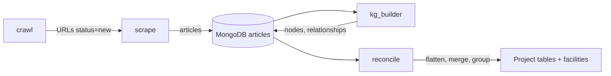
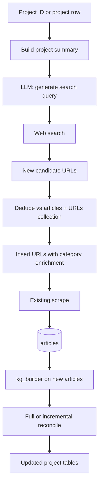

# Project enrichment: AI/LLM search for new articles and KG enrichment

## Current pipeline (context)

- **Projects** are defined in [reconcile/group.py](reconcile/group.py): `project_id = uuid5(iso2, admin_group_key, inst_canon, product_lv1)`. Grouped outputs and [reconcile/facilities.py](reconcile/facilities.py) write facility records (project_id, inst_canon, iso2, admin_group_key, product_lv1, etc.) to MongoDB.
- **New content** enters via the URLs collection: documents with `{ url, category, status: "new" }`. [scrape/scrape-articles.py](scrape/scrape-articles.py) consumes `status: "new"`, scrapes, inserts into articles_collection with `meta.category`, and sets URL status to `extracted`/`irrelevant`/`failed`.
- **Existing LLM + web search**: [web-browsing.py](web-browsing.py) uses the OpenAI Responses API with `web_search_preview` to answer a user prompt and return evidence with URLs; it does not currently feed those URLs into the DB or pipeline.

## Proposed architecture

## Implementation plan

### 1. Project summary and input

- **Source of project(s)**:
  - **Option A**: Read from MongoDB facilities collection (already has project_id, inst_canon, iso2, admin_group_key, product_lv1, latest_factory_status). Prefer this for a single project or small batch.
  - **Option B**: Read from reconciled Excel (e.g. [GROUPED_FACTORIES](reconcile/src/config.py) or grouped-capacities) to get project_id plus inst_canon, admin_group_key, product_lv1, iso2, and the list of **article_id**s attached to that project.
- **Articles attached to the project**: For each project, resolve **all** article IDs that belong to it (from grouped Excel or from a query that joins facilities/flatten output to articles). Fetch from articles_collection: at least `title`, and optionally first paragraph or a short snippet per article. Using only one or two articles would bias the summary and miss facets (e.g. capacity in one article, investment in another, location in a third).
- **Consistent summary**: From the project record (inst_canon, admin_group_key, product_lv1, iso2) **plus all attached article titles/snippets**, build a single coherent project summary. Options: (1) **Concatenate** structured fields and a list of titles/snippets into a fixed-format string for the next step; or (2) **LLM summarisation**: one short prompt that takes "Project: X, Region Y, Country Z, product_lv1: …" and "Existing articles: [title 1], [title 2], …" and returns a single, consistent 2–4 sentence summary (no redundancy, key facts merged). That summary is then used for search-query generation so the search step sees one consistent picture of the project. (Token counting and distribution stats for these collections are handled in a separate plan: "Project summary token distribution statistics".)

**Deliverable**: New module (e.g. `enrichment/` at repo root, or `reconcile/enrichment/`) with:

- `get_projects_for_enrichment(project_ids: list[str] | None, limit: int | None) -> list[dict]` reading from facilities collection (and optionally from Excel).
- `get_articles_for_project(project_id: str) -> list[dict]`: returns all articles linked to that project (from grouped tables or a join); each dict at least `article_id`, `title`, optionally `snippet` (e.g. first paragraph).
- `build_project_summary(project: dict, articles: list[dict], use_llm: bool = True) -> str`: builds one consistent summary from project fields and **all** attached article titles/snippets; if `use_llm`, call a small LLM step to merge and deduplicate into 2–4 sentences.

### 2. Search: query generation and URL discovery

- **Query generation**: Use the existing OpenAI client to call a chat/completion model with a small system prompt: "Given this clean-tech project summary, output 1–3 concise search queries (one per line) that would find recent news articles about this project (investments, capacity, construction, subsidies)." Input = project summary; output = plain text lines of queries.
- **URL discovery** (choose one or combine):
  - **Option A (recommended for minimal new deps)**: Use OpenAI Responses API with `web_search_preview` (as in [web-browsing.py](web-browsing.py)). Prompt: "Find recent news articles about: [project summary]. Return a list of full article URLs with publication date and title." Parse the model output (or a structured tool response if available) to extract URLs. Limitation: output format may be unstructured; may need a second LLM call to parse "list of URLs" from the response.
- **Deduplication**: Before inserting URLs:
  - Get existing URLs: (1) `articles_collection.distinct("meta.url")`, (2) `urls_collection.distinct("url")`.
  - Filter candidate URLs to those not in either set (normalise URL for comparison: strip fragment, lowercase host, etc.).
- **Insert**: Insert into URLs collection: `{ url, category: "enrichment", status: "new" }`. Optionally add `enrichment_for_project_id: project_id` (or a list of project_ids if one search served multiple projects) so you can later report which articles were discovered for which project. Ensure [scrape/scrape-articles.py](scrape/scrape-articles.py) can handle `category == "enrichment"`: it will use the default HTTP scraper path; add a date-extraction fallback for unknown sites (e.g. generic meta tags or "no date") if needed.

**Deliverable**:

- `enrichment/search.py` (or similar): `generate_queries(project_summary: str) -> list[str]`, `discover_urls(queries: list[str], method: "openai_web_search" | "serp") -> list[dict]` (each dict: url, title?, date?), `dedupe_and_insert_urls(candidates: list[dict], project_id: str | None) -> int` (returns count inserted).

### 3. URL text extraction: options for getting article text from new URLs

Enrichment URLs can point to **any** domain (news sites, press releases, blogs), not just the known crawl sources. The current scraper uses **per-category** logic: [scrape/scrap_function/utility.py](scrape/scrap_function/utility.py) has `DATE_SELECTORS` and special branches (e.g. `transformers-magazine`, `energytech`). For an unknown category like `"enrichment"`, it falls back to: **all `
` tags on the page** and **date = "No Date Found"** (then `get_utc_date_from_raw` uses today). That often pulls in nav, ads, and footer, and fails on JS-rendered or paywalled pages. Below are options, from simplest to most capable.

| Option                                      | Approach                                                                                                                                                                                                                                       | Pros                                                                                            | Cons                                                                                               |
| ------------------------------------------- | ---------------------------------------------------------------------------------------------------------------------------------------------------------------------------------------------------------------------------------------------- | ----------------------------------------------------------------------------------------------- | -------------------------------------------------------------------------------------------------- |
| **A. Default scrape path**                  | Use existing scrape with `category: "enrichment"`. No new code; `get_date(soup, "enrichment")` returns "No Date Found" (stored as fetch date). Body = all `
` from raw HTML.                                                                 | Zero new dependencies; works for simple static articles.                                        | No main-content detection; noisy text; no JS; date often wrong.                                    |
| **B. Generic HTML extractor (readability)** | Add a library that finds the “main” content block (article/main or heuristics), strip nav/ads, extract paragraphs. Examples: `readability-lxml`, `newspaper3k`, `goose3`, or `trafilatura`. Use for `category == "enrichment"` only.           | One extra dependency; much better main-content extraction on many sites; no per-site selectors. | Still no JS; date still heuristic (meta tags or regex); quality varies by site.                    |
| **C. Browser-based extraction**             | Use Selenium or Playwright: load URL in headless browser (executes JS), then extract text (e.g. `document.body.innerText` or run readability in browser). Use when requests-based fetch returns too little text or for known JS-heavy domains. | Handles JS-rendered pages.                                                                      | Slower, heavier; some sites block headless; still need heuristics or readability for main content. |
| **D. Extraction API / service**             | Call an external “URL → article text” API: e.g. **Mercury Parser** (Postlight, self-hosted or API), **Diffbot**, **Firecrawl**, **Jina Reader** (`r.jina.ai/{url}`), or similar. Send URL; get back title, date, clean text.                   | High quality on many sites; maintained by provider; often handle JS.                            | Cost, rate limits, external dependency; URLs leave your infrastructure (privacy).                  |
| **E. Hybrid pipeline**                      | Try **B** (or **A**) first. If result is “too short” or “no main content” (e.g. < 200 chars or no `<article>`), optionally retry with **C** or **D**. Store `meta.extraction_method: "readability"                                             | "browser"                                                                                       | "api"` for debugging.                                                                              |
| **F. Snippet-only (no full scrape)**        | If search API returns snippets (e.g. SerpAPI/Bing), store **snippet + URL + title** as a minimal “article” (no full body).                                                                                                                     | Fast; works when page is unscrapable or paywalled.                                              | Weak for KG (little text); use only as last resort or for lightweight evidence.                    |

**Recommendation**: Start with **B (readability-style)** for `category == "enrichment"`: add a single dependency (e.g. `trafilatura` or `readability-lxml`), implement an `extract_article_enrichment(url)` that returns `{ title, date, paragraphs }`, and call it from [scrape/scrape-articles.py](scrape/scrape-articles.py) when `category == "enrichment"` instead of the default soup path. Add a **generic date fallback** (e.g. `<meta property="article:published_time">`, or `datetime` in HTML, or “No Date Found”) in [scrape/scrap_function/utility.py](scrape/scrap_function/utility.py). If many enrichment URLs fail or return junk, introduce **E (hybrid)** with browser or an extraction API as fallback.

### 4. Wiring into scrape and KG

- **Scrape**: For `category == "enrichment"`, either (1) use the default HTTP + all-`
` path and a date fallback, or (2) prefer a dedicated extractor (Option B above) and a generic date fallback. If date extraction fails, use fetch date. Optionally copy `enrichment_for_project_id` from URL doc to article `meta`.
- **KG extraction**: Run the existing kg_builder pipeline only on articles that have `meta.category == "enrichment"` (and optionally `meta.enrichment_for_project_id` in a given set). Options:
  - **A**: Add a small script (e.g. `kg_builder/run_enrichment_articles.py`) that queries `articles_collection.find({ "meta.category": "enrichment", "nodes": { "$exists": false } })` (or similar), then calls the same extraction flow as [kg_builder/main.py](kg_builder/main.py) (reuse `process_articles` and extraction helpers). This avoids re-processing all articles.
  - **B**: Run full `kg_builder/main.py` with categories including `"enrichment"` and rely on existing skip logic (already processed, validated); only new articles get processed.
- **Reconcile**: After new articles have nodes/relationships, run the full reconcile pipeline ([reconcile/main.py](reconcile/main.py)) so that flatten, merge, normalise, and group all see the new articles. Result: ALL_NODES/ALL_RELS and project-level tables (and facilities) include the new data. No need for incremental merge in a first version.

**Deliverable**:

- Script or CLI: `enrichment/run_enrichment.py` (or `python -m enrichment`) that: (1) takes `--project-id` or `--project-ids` or `--limit`, (2) gets project summaries, (3) generates queries, (4) discovers URLs, (5) dedupes and inserts URLs, (6) optionally runs scrape (subprocess or in-process), (7) optionally runs KG on enrichment articles, (8) optionally runs reconcile. Make steps 6–8 configurable (flags or config) so users can run scrape/KG/reconcile separately if they prefer.

### 5. Optional: link articles back to project and reporting

- When scrape inserts an article from a URL that had `enrichment_for_project_id`, copy that into the article document: e.g. `meta.enrichment_for_project_id: project_id` (or list). This requires scrape to read the URL document when processing and copy optional fields into `meta`. Then you can query "all articles added for project X" and report them (e.g. in a small report or in the facilities UI).
- Optional: store enrichment run metadata (e.g. project_id, run_ts, urls_found, urls_inserted, articles_created) in a small collection or log for auditing.

### 6. Config and dependencies

- **Config**: Use existing `.env` for MongoDB and OpenAI. If using SerpAPI/Bing, add `SERPAPI_KEY` or similar and read in the new module.
- **Dependencies**: If Option B or C for search: add `requests` (or existing) for search API; no new dependency for Option A (OpenAI only).
- **Reconcile config**: Add `"enrichment"` to [ARTICLE_QUERY](reconcile/src/config.py) `meta.category` list so flattened/merged outputs include enrichment-sourced articles.

## Suggested file layout

- `enrichment/` (new package at repo root)
  - `__init__.py`
  - `config.py` — e.g. category name, optional search API keys, limits.
  - `projects.py` — get project(s) from facilities or Excel; build project summary.
  - `search.py` — generate queries (LLM); discover URLs (OpenAI web search and/or external API); dedupe; insert into URLs collection.
  - `run_enrichment.py` — CLI: project selection, run search + optional scrape/KG/reconcile.
- Updates to existing code:
  - [reconcile/src/config.py](reconcile/src/config.py): add `"enrichment"` to `ARTICLE_QUERY["meta"]["category"]`.
  - [scrape/scrape-articles.py](scrape/scrape-articles.py): handle `category == "enrichment"` (date fallback, and optionally copy `enrichment_for_project_id` from URL doc to article meta).

## Summary

| Step | Action                                                                                                               |
| ---- | -------------------------------------------------------------------------------------------------------------------- |
| 1    | Define project input (facilities or Excel) and build project summary.                                                |
| 2    | LLM generates search queries; web search (OpenAI and/or external API) returns candidate URLs.                        |
| 3    | Dedupe against articles + URLs; insert new URLs with `category: "enrichment"`, optional `enrichment_for_project_id`. |
| 4    | Run existing scrape; optionally copy project_id into article meta.                                                   |
| 5    | Run kg_builder on enrichment articles only (small script) or full main with enrichment category.                     |
| 6    | Run full reconcile so new articles flow into project structure.                                                      |
| 7    | Optionally report or store which articles were added for which project.                                              |

This reuses crawl → scrape → kg_builder → reconcile and adds a single "enrichment" path that starts from a project and injects new URLs into the same pipeline.