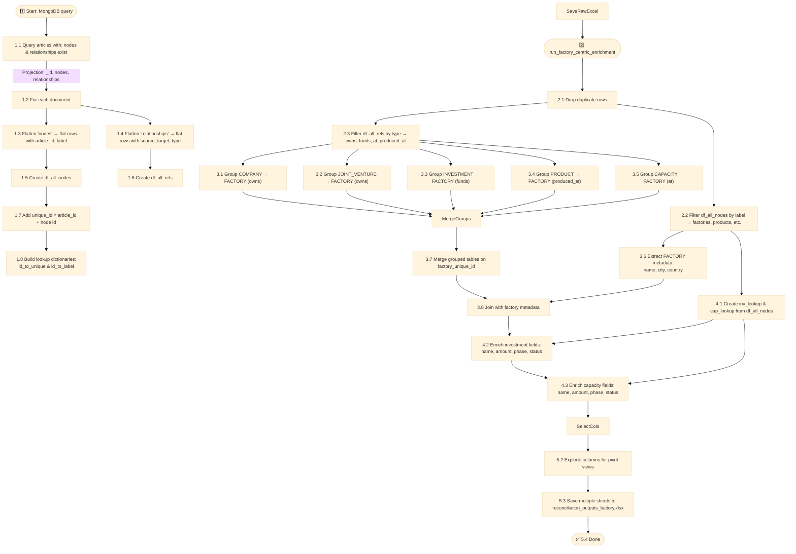

# to_pand.py explainer

## Overview
 This script extracts and processes data from a MongoDB collection where each article includes nodes (e.g., companies, factories, investments) 
 and relationships (e.g., owns, funds, produced_at). Each node is given a unique ID by combining its article ID and internal ID to ensure global uniqueness.
 Relationships reference node IDs, so these are translated to the new unique node IDs. Each source and target in a relationship is also enriched
 with the type of node it refers to (e.g., company, factory), using the original node metadata. This makes it easier to group and interpret relationships later.
 
 The pipeline focuses on factories: it identifies which companies or joint ventures own them, which investments fund them, 
 what products are made there, and what capacities are installed. This is done by grouping relationship data by factory ID and enriching it 
 using metadata from the original nodes (such as name, phase, amount, status).
 
 The result is a set of clean Excel files where each factory has its ecosystem (direct links) of owners, products, investments, and capacities clearly organised
 into summary and pivoted views for easy exploration.



```
